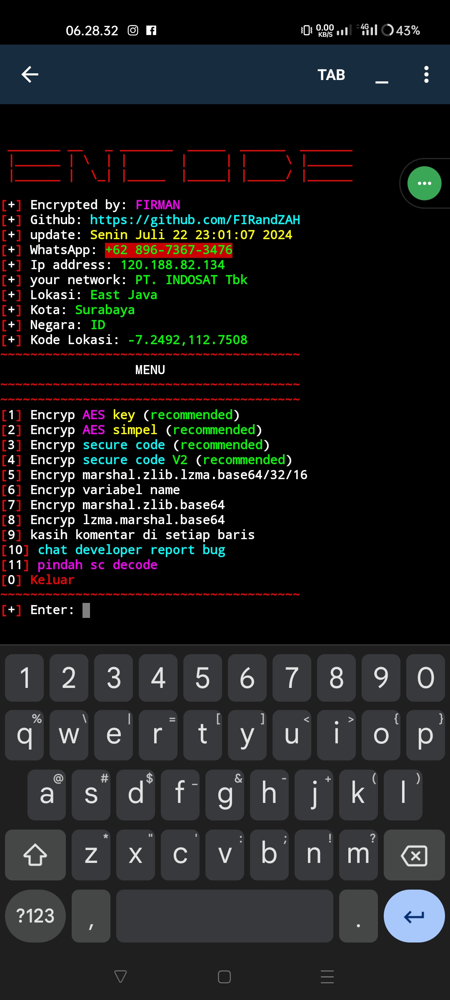

<p align="center">
  Made with ❤️ by FIRandZAH
</p>

[](https://git.io/typing-svg)

## 🚀 Install and Run

Untuk menginstal dan menjalankan script encoding ini, ikuti langkah-langkah berikut:

```sh
pkg install python python-pip git -y
pip install base16 requests
git clone https://github.com/FIRandZAH/encode
cd encode
python enc.py
```
<h2>_SCREENSHOT_</h2>
<br>
<p align="center">
  
</p>

## 📬 Contact

Jika kamu memiliki pertanyaan atau masukan, jangan ragu untuk menghubungi saya di
WhatsApp https://wa.me/+6283170597744
