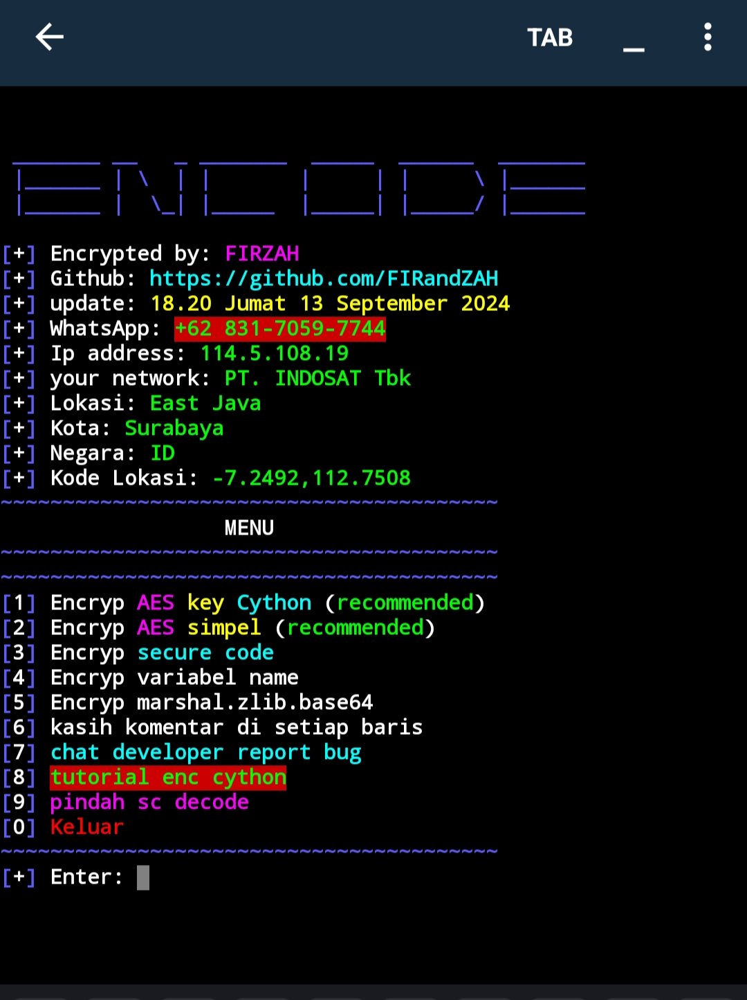
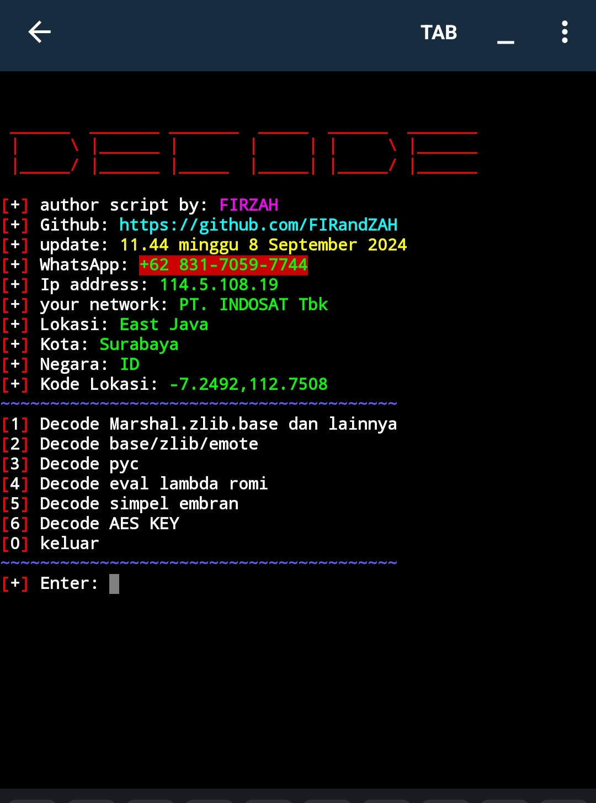

<p align="center"> 
 PENGUNJUNG 

 
</p>

<p align="center">
  Script by: FIRZAH
</p>

[](https://git.io/typing-svg)

## 🚀 Install and Run (Encryption)

Untuk menginstal dan menjalankan script encode ini, ikuti langkah-langkah berikut:

```sh
$ pkg update && pkg upgrade -y
$ pkg install python -y
$ pkg install python-pip -y
$ pkg install git -y
$ pip install base16
$ pip install requests
$ pip install cython
$ pip install pycryptodome
$ git clone https://github.com/FIRandZAH/encode
$ cd encode
$ python enc.py
```

<br>
<p align="center">
  
</p>

## 🔐 Opsi 1: The Best Encryption

Opsi 1 menggunakan kombinasi AES dan Cython untuk mengenkripsi file Python. File Python dienkripsi menggunakan AES, dan untuk menjalankan file yang sudah dienkripsi, diperlukan kunci AES. Kunci AES ini kemudian dienkripsi lagi menggunakan kombinasi Marshal, zlib, base, dan Cython untuk memberikan keamanan tambahan.
- **kelebihan enc AES KEY cython dari cython biasa**
- **1** codingan python tidak perlu rapih.
- **2** bisa berapapun ukuran file python.
## 🚀 Install and Run (Decode)

Untuk menginstal dan menjalankan script decode ini, ikuti langkah-langkah berikut:

```sh
$ pkg update && pkg upgrade -y
$ pkg install python -y
$ pkg install python-pip -y
$ pkg install git -y
$ pip install requests
$ pip install pycryptodome
$ git clone https://github.com/FIRandZAH/encode
$ cd encode
$ chmod +x pycdc
$ python decode.py
```

<br>
<p align="center">
  
</p>

## 🔧 Fitur :

- **1. Decode Marshal.zlib.base dan lainnya:** Untuk mendekripsi enkripsi kombinasi seperti Marshal.zlib.base.lzma dan lainnya.
- **2. Decode base/zlib/emote:** Untuk mendekripsi enkripsi tunggal seperti base/zlib/emote kecuali Marshal.
- **3. Decode pyc:** Untuk mendekripsi file .pyc.
- **4. Decode eval lambda romi:** Untuk mendekripsi skrip yang di enc menggunakan eval lambda script romi.
- **5. Decode simpel embran:** Untuk mendekripsi skrip yang di enc menggunakan simpel embran script embran.
- **6. AES KEY:** Untuk mendekripsi skrip yang di enc AES key cython file utama .txt di perlukan key yang di pake enc.
- **Note:** Jika pycdc tidak support, itu mungkin karena versi pycdc yang digunakan di dalam script tidak mendukung beberapa versi Python kalo mau support sini WhatsApp tf 1jt 😋.

## 📬 Contact

Jika kamu memiliki pertanyaan atau masukan, jangan ragu untuk menghubungi saya di WhatsApp melalui tautan ini: https://wa.me/+6283170597744.
