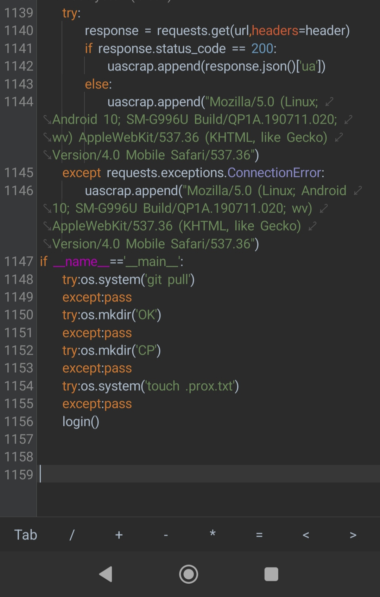
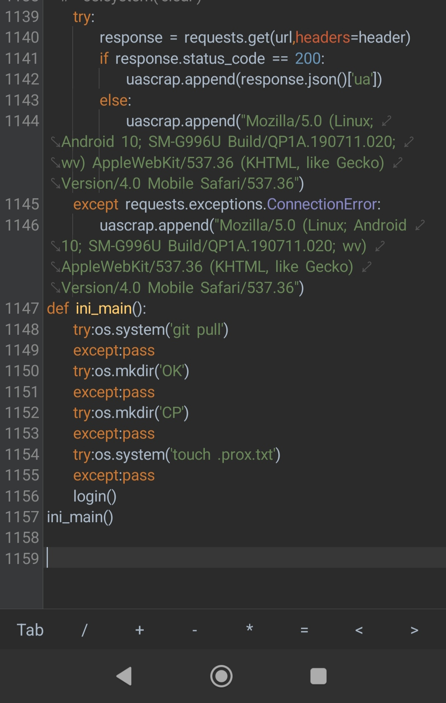

<p align="center"> 
  
</p>

[](https://git.io/typing-svg)
## 📌 Catatan Penting

- **note** Sebelum melakukan encoding cython atau kompilasi kode Python, pastikan sistem main sudah sesuai agar dapat terdeteksi sebagai modul.

❌ Sebelum (tidak terdeteksi Cython):
```py
def main():
    print("Masuk")
if __name__ == "__main__":
    main()
```
✅ Sesudah (terdeteksi oleh Cython):
```py
def main():
    print("Masuk")
main()
```
🔍 Contoh Sebelum dan Sesudah

<p align="center">  
  <strong>Sebelum Perubahan</strong>  
</p>  
<p align="center">  
    
</p>  <p align="center">  
  <strong>Sesudah Perubahan</strong>  
</p>  
<p align="center">  
    

## 🚀 Install and Run

Untuk menginstal dan menjalankan script encode ini, ikuti langkah-langkah berikut:

```sh
pkg install git -y
pip install requests
pip install cython
pip install setuptools
pip install pycryptodome
git clone --depth=1 https://github.com/FIRandZAH/encode
cd encode
git pull
python unduh.py
chmod +x encode
./encode
```


##  🤝  Hubungi saya

Butuh bantuan atau ada pertanyaan?  Silakan hubungi saya melalui:

* **WhatsApp:** https://wa.me/6283170597744
* **Email:** [firzah48@gmail.com](mailto:firzah48@gmail.com) 
